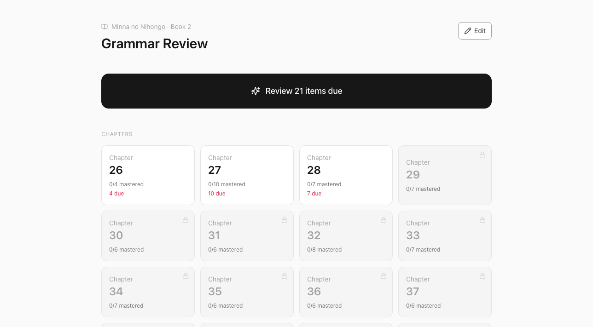
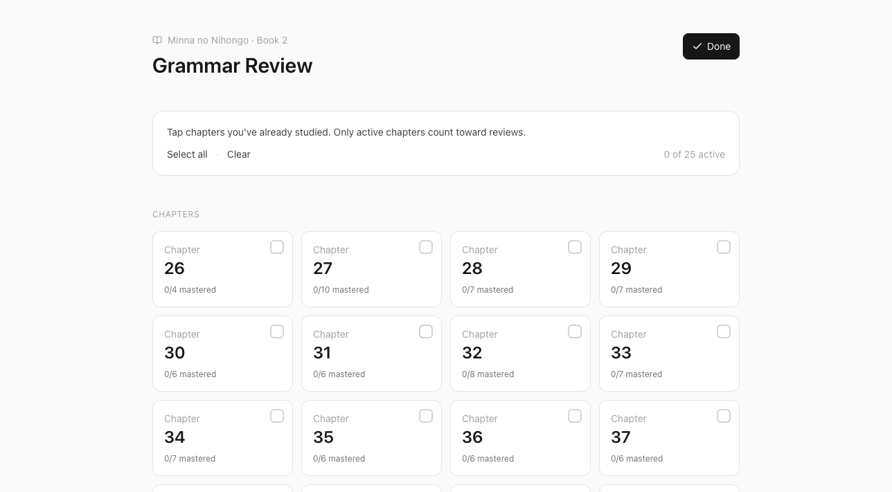
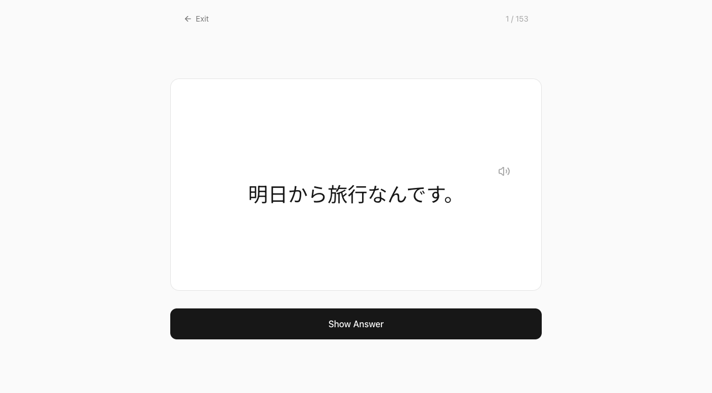
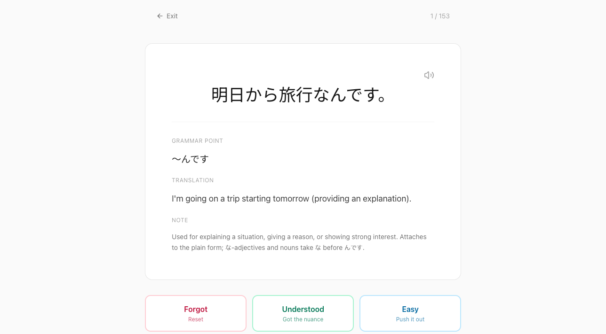

# Minna SRS — Book 2

A minimalist, distraction-free spaced-repetition system for learning grammar from **Minna no Nihongo Book 2** (chapters 26-50).

**Live:** https://alexistonneau.github.io/japanese-grammar-srs/

---

## Why this exists

Bunpro is cluttered. Anki's Right/Wrong grading is too binary for grammar nuance — Book 2 hinges on context and politeness levels, not 1:1 translations.

This app trades feature breadth for a clean review loop and a 3-button "vibe check" grading system focused on comprehension.

## Screenshots

### Dashboard
Chapter grid with per-chapter mastered counts and a single "Review Due" CTA. Inactive chapters are locked so you only review what you've actually studied.



### Selecting which chapters you've studied
Tap **Edit** to toggle chapters on or off. Only active chapters count toward reviews.



### Review card — front
Large Japanese typography, optional TTS, single "Show Answer" action.



### Review card — back
Grammar point, translation, and a structural/nuance note. Three grades: **Forgot** resets the interval, **Understood** advances normally, **Easy** pushes the interval far out.



## Features

- **3-button comprehension grading** — Forgot / Understood / Easy
- **Simplified SM-2 algorithm** with per-item `interval`, `easeFactor`, and `nextReviewDate`
- **localStorage-backed progress** — no account, no backend
- **Web Speech API** for Japanese TTS (uses your OS's `ja-JP` voices)
- **Installable as a PWA** — works offline, full-screen on iOS/Android home screen
- **153 grammar items** seeded across all 25 chapters of Book 2

## Install as an iPhone app

1. Open the [live site](https://alexistonneau.github.io/japanese-grammar-srs/) in **Safari** (not Chrome — iOS only allows Safari to install PWAs).
2. Tap **Share** → **Add to Home Screen**.
3. Launch from the home screen — full-screen, no browser chrome, works offline.

On Android, Chrome will offer an install prompt automatically.

## Tech

- Vite + React 18 + TypeScript
- Tailwind CSS
- Lucide React icons
- Web Speech API for TTS
- GitHub Pages deployment via Actions

## Project structure

```
src/
├── App.tsx                  view router (dashboard ↔ review)
├── data/grammarData.ts      curriculum content (immutable)
├── srs/
│   ├── types.ts             Grade, Progress, ProgressStore
│   ├── algorithm.ts         pure SM-2-lite (no React)
│   ├── storage.ts           localStorage adapter (source of truth)
│   ├── supabase.ts          Supabase client (null when env vars unset)
│   ├── sync.ts              local ↔ Supabase reconciliation, auth helpers
│   └── useSrs.ts            React hook over algorithm + store
├── lib/tts.ts               Web Speech API wrapper
└── components/
    ├── Dashboard.tsx
    ├── ReviewSession.tsx
    ├── ReviewCard.tsx
    └── SyncStatus.tsx       sign-in / sign-out chip
```

The curriculum (`grammarData.ts`) is immutable. Progress flows: UI writes hit `localStorage` first (always), then `sync.ts` pushes the same write to Supabase if a user is signed in. Reads come from `localStorage` only — there's no read-time network round-trip. On startup, `initSync()` does a one-shot pull-and-merge so the local cache catches up with anything written from another device.

## Development

```bash
npm install
npm run dev          # http://localhost:5173/japanese-grammar-srs/
npm run build        # typecheck + production bundle to dist/
```

## Deployment

Pushes to `main` trigger `.github/workflows/deploy.yml`, which builds and publishes to GitHub Pages. The Vite `base` config is set to `/japanese-grammar-srs/` to match the Pages subpath.

## Optional: Supabase sync

Progress is local-first; when Supabase is configured the same data also syncs across devices via anonymous sign-in plus a paste-able sync code. With no env vars set the app runs in localStorage-only mode (no sign-in UI, no network calls).

**Why anonymous + sync code, instead of email?** iOS opens email links in Safari, which has a separate storage origin from a home-screen PWA — magic links never reach the PWA. Email OTP codes work but require editing the email template, which Supabase locks behind custom SMTP on free projects. Anonymous sign-in skips email entirely: the first device creates an anonymous user, then exports a one-time sync code that the second device pastes to share the same `auth.uid()`.

To enable:

1. Create a free Supabase project at [supabase.com](https://supabase.com).
2. Run [`docs/supabase-schema.sql`](docs/supabase-schema.sql) in the project's SQL editor — creates the `progress` and `active_chapters` tables with Row Level Security so each user only sees their own rows.
3. In **Authentication → Sign In/Up**, toggle **"Allow anonymous sign-ins"** ON.
4. In **Authentication → Sessions**, set **"Refresh token rotation"** to OFF (or extend the reuse interval). Default rotation invalidates the refresh token after first use, which would break the second device when its session refreshes. For a single-user, multi-device setup, disabling rotation is fine.
5. Add two repository secrets under **Settings → Secrets and variables → Actions**:
   - `VITE_SUPABASE_URL` — your project URL (e.g. `https://abc123.supabase.co`)
   - `VITE_SUPABASE_ANON_KEY` — the public anon key (Settings → API). Safe to embed in client code; Row Level Security is what enforces access control.
6. Push to `main` to redeploy.

After that, the dashboard shows a "Sign in to sync" chip. On the first device, click **Enable sync** — your progress starts syncing immediately. To add a second device, click **Add device** to copy a sync code, then paste it on the new device under "I have a sync code from another device". Anyone with the code gets full access to your data — treat it like a password, store it in your password manager.

## Roadmap

- Keyboard shortcuts (Space = show answer, 1/2/3 = grade)
- Daily new-card cap and review limit
- Settings panel: reset progress, export/import

## Source attribution

Grammar points and example sentences seeded from [learnjapaneseaz.com](https://learnjapaneseaz.com/) lessons 26-50, with corrections to typos and translations against standard Minna no Nihongo Book 2 text.
